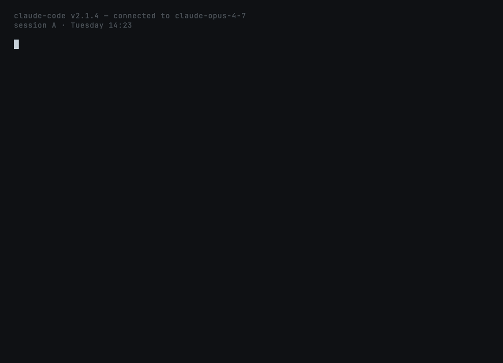

# `amnesia-fix` — cross-session memory

**Fixes:**
[`anthropics/claude-code#14227`](https://github.com/anthropics/claude-code/issues/14227) (OPEN),
[`anthropics/claude-code#27298`](https://github.com/anthropics/claude-code/issues/27298),
[`anthropics/claude-code#43696`](https://github.com/anthropics/claude-code/issues/43696)



## What this prevents

> *"Every Claude Code session starts amnesiac."* — issue #14227

Decisions you wrote down yesterday are gone today. `amnesia-fix`
persists them per-project — automatically, no manual `notes.md`.

## How it works

```
                ┌────────────────────────────────┐
                │  .papercuts/journal.md         │
                │  (project-local, append-only)  │
                └────────────────────────────────┘
                          ▲              │
                  appends │              │ loads
                          │              ▼
   ┌─────────────────────────────┐   ┌──────────────────────────┐
   │  Stop hook                  │   │  SessionStart hook        │
   │  journal-append.sh          │   │  journal-load.sh          │
   │                             │   │                           │
   │  - extracts decisions       │   │  - reads last 3 entries   │
   │  - extracts next steps      │   │  - prints to stdout       │
   │  - extracts blockers        │   │  - Claude Code injects    │
   │  - tracks files edited      │   │    as session context     │
   │  - caps at 500 chars        │   │                           │
   └─────────────────────────────┘   └──────────────────────────┘
```

## What's installed

| Path | What |
|---|---|
| `skills/amnesia-fix/SKILL.md` | Auto-invocation + manual recap procedure |
| `skills/amnesia-fix/hooks/journal-append.sh` | Stop hook (bash + python) |
| `skills/amnesia-fix/hooks/journal-load.sh` | SessionStart hook (bash + python) |
| `hooks/hooks.json` | Registers both hooks |

## Sample journal entry

```markdown
## 2026-05-15 17:23 UTC | main | Refactor auth middleware to use bearer tokens
- Files: src/middleware/auth.ts, src/__tests__/auth.test.ts
- Decisions:
  - bearer tokens validated against the existing in-memory store
  - keep the rate limiter unchanged
- Next:
  - invalidate active cookie sessions in a migration before we ship
- Blockers:
  - need staging-environment access to test the migration
```

## What survives what

| | `/clear` | `/compact` | `--resume` | `--continue` | restart |
|---|:---:|:---:|:---:|:---:|:---:|
| Claude Code's own history | ✗ | partial | ⚠ broken (#43696) | ⚠ broken (#43696) | ✗ |
| `amnesia-fix` journal | ✅ | ✅ | ✅ | ✅ | ✅ |

The journal is a plain markdown file on disk. None of those events
touch it.

## Trying it locally

```bash
# Load the plugin
claude --plugin-dir ~/claude-papercuts

# Do some work that includes "Decision: ..." or "Next: ..." phrases
# in your responses

# End the session, start a new one in the same project
claude --plugin-dir ~/claude-papercuts

# Your new session will start with the prior journal entries
# auto-loaded as context. Ask "what were we working on?" and
# Claude will know.
```

## What gets extracted

The Stop hook scans the final assistant message for these markers
(case-insensitive, anywhere in the text — not just at line start):

- **Decision** / **Decided** → goes into `Decisions:`
- **Next** / **Next step** / **TODO** → goes into `Next:`
- **Blocker** / **Blocked by** → goes into `Blockers:`

It also collects file paths from `Edit`/`Write`/`MultiEdit` tool
uses across the whole turn. Caps everything at 5 items per section,
200 chars per item, 500 chars per entry.

If none of those markers are found AND no files were edited, the
hook stays silent — avoiding journal pollution from trivial
"hello"-style exchanges.

## Configuration

Defaults work for most projects. Future versions will read
`.papercuts/config.json`:

```json
{
  "amnesia_fix": {
    "load_entries": 3,
    "max_entry_chars": 500,
    "max_items_per_section": 5
  }
}
```

## What this skill does NOT do

- **Not global.** The journal is per-project (`<cwd>/.papercuts/journal.md`).
  No cross-project leakage.
- **Does not edit or dedupe entries.** Append-only on the write
  side, read-only for the user-side procedure.
- **Does not auto-resume work.** The injected context is
  informational. Claude won't unilaterally start editing files
  based on the journal — you still drive the conversation.

## Privacy

Journal is a local markdown file. No network calls. Add
`.papercuts/` to your `.gitignore` if not already.

## Deprecation plan

If Anthropic ships built-in persistent cross-session memory
(per issue #14227), this skill becomes a no-op and gets deprecated
in the next monthly release with the date.
