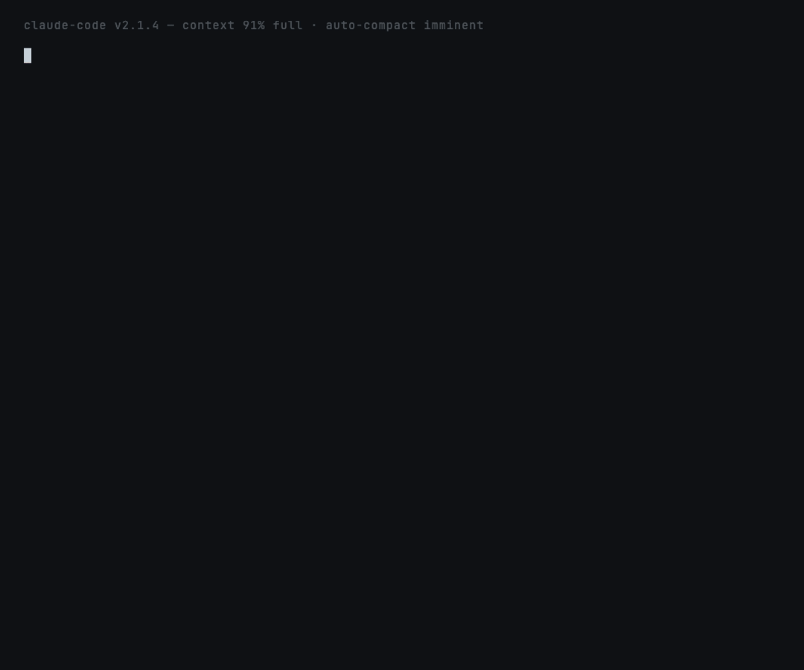

# `compact-guard` — survive `/compact`

**Fixes:**
[`anthropics/claude-code#24686`](https://github.com/anthropics/claude-code/issues/24686),
[`anthropics/claude-code#26061`](https://github.com/anthropics/claude-code/issues/26061)



## What this prevents

> *"After context compaction occurs during plan mode execution, Claude
> Code fails to re-read or reference the existing plan."* — issue #24686

You're 30 turns into a careful refactor. `/compact` runs (manually or
because you hit the auto-compact threshold). The summarizer condenses
*everything*, including the plan you were halfway through. Claude
wakes up without the plan, and you re-prompt from scratch.

`compact-guard` snapshots the plan *before* compaction touches it,
then re-injects the snapshot as context immediately after.

## How it works

```
                ┌─────────────────────────────────────┐
                │  .papercuts/compact-snapshots/      │
                │  <UTC-timestamp>.md (last 5)        │
                └─────────────────────────────────────┘
                          ▲              │
                  writes  │              │ reads
                          │              ▼
   ┌────────────────────────────┐   ┌──────────────────────────────┐
   │  PreCompact hook            │  │  SessionStart hook            │
   │  save-state.sh              │  │  load-state.sh                │
   │                             │  │                               │
   │  - last user message        │  │  - only fires when            │
   │  - active todos             │  │    source == "compact"        │
   │    (pending + in_progress)  │  │  - reads newest snapshot      │
   │  - files edited             │  │  - prints to stdout           │
   │  - last assistant plan      │  │  - Claude Code injects        │
   │  - keeps 5 most recent      │  │    as session context         │
   └────────────────────────────┘   └──────────────────────────────┘
```

## What's installed

| Path | What |
|---|---|
| `skills/compact-guard/SKILL.md` | Auto-invocation + manual recap procedure |
| `skills/compact-guard/hooks/save-state.sh` | PreCompact hook (bash + python) |
| `skills/compact-guard/hooks/load-state.sh` | SessionStart hook (bash + python) |
| `hooks/hooks.json` | Registers both hooks |

## Sample snapshot

```markdown
# compact-guard snapshot

- **When:** 2026-05-16 09:14 UTC
- **Trigger:** auto-compact
- **Session:** abc123def456

## Current task (last user message)
> Looks good, now add tests.

## Active todos
- [in_progress] Replace cookie validation
- [pending] Update auth.test.ts

## Files edited this session
- `src/middleware/auth.ts`

## Last assistant message (plan / summary)

Plan:
1. Add positive-case test for valid bearer token
2. Add negative-case test for malformed token
3. Add edge-case test for missing Authorization header
```

## What survives what

| | `/compact` (manual) | auto-compact | `/clear` | restart |
|---|:---:|:---:|:---:|:---:|
| Claude Code's own plan-mode state | ⚠ degraded | ⚠ degraded | ✗ | ✗ |
| `compact-guard` snapshot | ✅ | ✅ | ✅ (file on disk) | ✅ (file on disk) |

The snapshot is a plain markdown file on disk. None of those events touch
it. The post-compact context injection only kicks in when SessionStart
fires with `source="compact"`, so other sources (startup, resume, clear)
don't get the noise — use `amnesia-fix` for those.

## Trying it locally

```bash
# Load the plugin in any project
claude --plugin-dir ~/claude-papercuts

# Work on something — make a plan, accumulate todos, edit files
# Then trigger a compact: /compact

# After compaction, the post-compact turn will start with the snapshot
# already injected. Ask "what was I working on?" and Claude will know.
```

## What gets captured

- **Most recent user message** (the *current* task, not the first one)
- **Active TodoWrite items** — pending + in_progress only; completed
  todos are skipped because they're not useful for resuming
- **File paths** from `Edit` / `Write` / `MultiEdit` / `NotebookEdit`
  tool uses across the whole transcript
- **Last assistant text block**, capped at 1,500 chars — this is
  usually the working plan or the latest summary

Sections with nothing useful are omitted entirely.

## Configuration

Defaults work for most projects. Five snapshots are kept (oldest
pruned automatically). Future versions will read `.papercuts/config.json`:

```json
{
  "compact_guard": {
    "max_snapshots": 5,
    "max_plan_chars": 1500,
    "max_todo_items": 12
  }
}
```

## What this skill does NOT do

- **Not global.** Snapshots are per-project (`<cwd>/.papercuts/compact-snapshots/`).
- **Does not block compaction.** PreCompact runs read-only and exits 0.
  Use `amnesia-fix` if you want similar protection between separate
  sessions.
- **Does not auto-resume work.** The injected context is informational;
  Claude won't unilaterally start editing files based on the snapshot.

## Privacy

Snapshots are local markdown files. No network calls. Add `.papercuts/`
to your `.gitignore` if not already.

## Deprecation plan

If Anthropic ships compact-resilient plan-mode (per #24686 / #26061),
this skill becomes a no-op and gets deprecated in the next monthly
release with the date.
