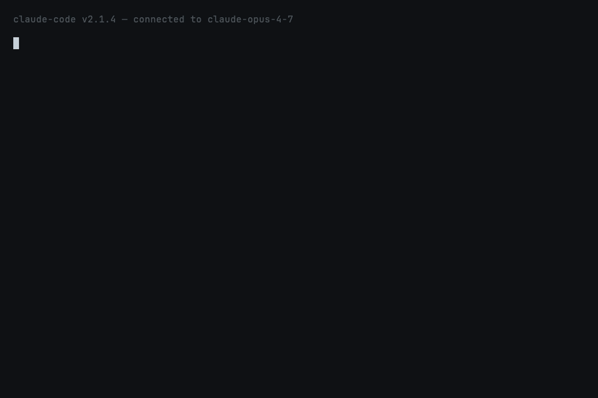

# `done-prover` — verify Claude's "done"

**Fixes:**
[`anthropics/claude-code#5052`](https://github.com/anthropics/claude-code/issues/5052),
[`anthropics/claude-code#10628`](https://github.com/anthropics/claude-code/issues/10628),
[`anthropics/claude-code#20350`](https://github.com/anthropics/claude-code/issues/20350)



## What this prevents

> *"Tests pass because they test structure and mock implementations
> rather than actual functionality."* — pattern observed in #5052

Claude can say "all 47 tests pass" when 2 failed, 1 was skipped, and
the integration suite never ran. `done-prover` catches the lie before
it leaves the conversation.

## How it works

```
End of every assistant turn
        │
        ▼
   Stop hook fires
        │
        ▼
Read final assistant message
        │
        ▼
Does it claim test success?      ──► No   →  silent exit
        │
       Yes
        ▼
Scan recent tool_result entries
        │
        ▼
Does any show failure signals?   ──► No   →  silent exit (claim is honest)
        │
       Yes
        ▼
Emit decision=block + verdict
Write .papercuts/proofs/<ts>.md
        │
        ▼
Claude must address the lie
before the conversation can end.
```

## What gets matched

### Claim phrases (in the final assistant message)

- `all tests pass(ed|ing)?`
- `all tests are passing`
- `all checks pass`
- `\d+ tests? pass`
- `\d+/\d+ tests? pass`
- `everything (passes|passed|is green)`
- `all green`
- `tests all clean`

### Failure signals (in recent tool output)

- `\d+ failed`
- `FAILED` / `FAIL` markers
- `ERROR` markers
- `AssertionError` / `ImportError`
- `\d+ error[s]?`
- `Test.*failed`

## What's installed

| Path | What |
|---|---|
| `skills/done-prover/SKILL.md` | Skill metadata + manual-invoke instructions |
| `skills/done-prover/hooks/verify-claims.sh` | Stop hook (bash → python) |
| `hooks/hooks.json` | Registers the hook |

## Trying it locally

```bash
# Load the plugin
claude --plugin-dir ~/claude-papercuts

# Ask Claude to "verify" something where tests have failed
# (use a project with a failing test). When Claude tries to say
# "all tests pass", the Stop hook will block and surface the verdict.
```

## Configuration

Optional `.papercuts/config.json` in the project root:

```json
{
  "done_prover": {
    "claim_phrases": ["all tests pass", "..."],
    "failure_patterns": ["FAIL", "ERROR", "\\d+ failed"],
    "verdict_dir": ".papercuts/proofs"
  }
}
```

The defaults work for pytest, npm test, go test, cargo test, and
any output that uses common failure keywords.

## What this skill does NOT do

- **It does not re-run tests.** It only verifies the output Claude
  already saw, which is faster and matches what the user observed.
- **It does not block "done" claims.** Only claims about test results.
  "I've finished the refactor" is fine. "All tests pass" gets verified.
- **It is not exhaustive.** Unusual test runners with non-standard
  output formats may slip past the failure-signal regex. False
  negatives are possible; false positives are designed to be rare.

## Privacy

Verdicts are written to `.papercuts/proofs/` in your project. No
network calls. The directory is gitignored by default.

## Deprecation plan

If Anthropic ships first-class completion verification (e.g. a
`/verify-claim` slash command or test-aware Stop behavior), this
skill becomes a no-op. We'll update this README with the date and
deprecate the skill in the next monthly release.
