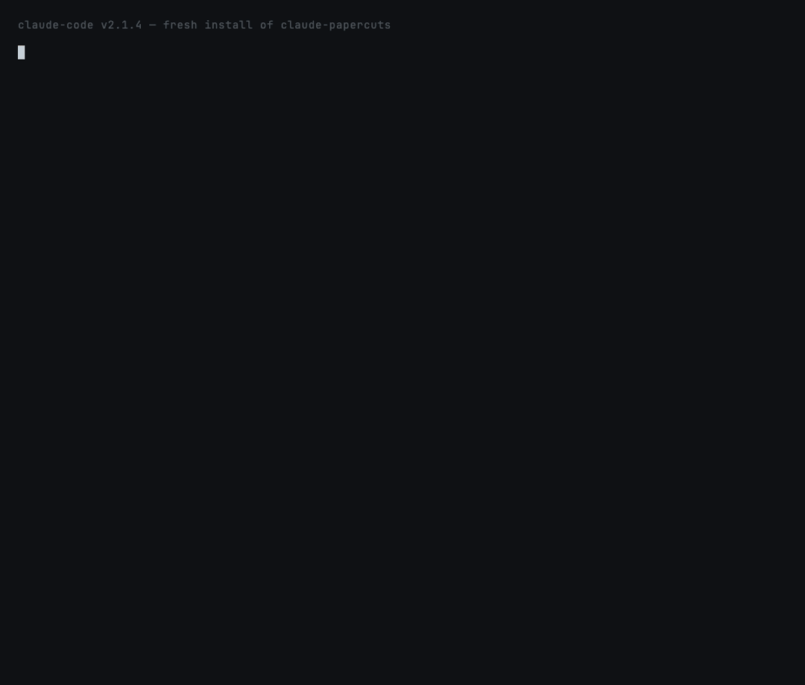

# `onboard` — first-run walkthrough

**Fixes:** New-user churn documented in
[MindStudio's Claude Code onboarding analysis](https://app.mindstudio.ai/blog/claude-code-skills-explained)
and Medium "I installed 40 skills and Claude got worse" reports.



## What this prevents

> *"I followed a tutorial, installed 25 skills, and now Claude is
> noticeably slower and ignores half of them. I uninstalled
> everything."* — common Medium / Reddit complaint, Dec 2025

The claude-papercuts plugin ships nine skills. Most users don't need
all nine on day one. `onboard` is the curated install order: which
skill solves which problem, in priority order, with a one-sentence
"why" each.

## How it works

```
User runs /claude-papercuts:onboard
        │
        ▼
Run recommend.py
        │
        ▼
Detect which papercut skills are already installed
(scan ~/.claude/plugins/*/skills/*/SKILL.md)
        │
        ▼
Render: priority-ordered list of all 9, marked installed / not
        │
        ▼
Suggest the next 1–3 to enable based on user's actual workflow
```

## What's installed

| Path | What |
|---|---|
| `skills/onboard/SKILL.md` | Auto-invocation + interview procedure |
| `skills/onboard/recommend.py` | Standalone Python — no deps, works on macOS / Linux / WSL |

## The opinionated order (and why)

| # | Skill | Enable if … |
|---|---|---|
| 1 | `safe-shell` | Always first — irreversible-command refusal, no downside |
| 2 | `token-x-ray` | You want to see where your context tokens go |
| 3 | `amnesia-fix` | You run >1 Claude session per day |
| 4 | `compact-guard` | You ever hit `/compact` (most users will) |
| 5 | `done-prover` | You ship code Claude writes |
| 6 | `unclear` | You've ever run `/clear` and regretted it |
| 7 | `skill-doctor` | You author your own SKILL.md files |
| 8 | `skill-budget` | You have 10+ skills installed |
| 9 | `subagent-broker` | You run multi-stage agentic workflows |

## Sample output

```text
claude-papercuts — onboarding walkthrough
────────────────────────────────────────────────────────────

These are the nine papercut skills, in the order we recommend
enabling them for a new install.

  ✓ 1. safe-shell                        installed
      Refuses rm -rf ~/, git push --force, mkfs, etc. — even in --dangerously-skip-permissions mode.
      for: everyone

  ✓ 2. token-x-ray                       installed
      Shows you exactly which MCP server / skill / CLAUDE.md is eating your context.
      for: everyone

  ○ 3. amnesia-fix                       not installed
      Cross-session memory.
      for: anyone running multiple Claude sessions per day
  ...
────────────────────────────────────────────────────────────
Next to enable: amnesia-fix
  → Cross-session memory. Every new session starts knowing what the last one decided.
```

## Trying it locally

```bash
claude --plugin-dir ~/claude-papercuts
/claude-papercuts:onboard
```

Or run the script directly:

```bash
~/claude-papercuts/skills/onboard/recommend.py
~/claude-papercuts/skills/onboard/recommend.py --next
~/claude-papercuts/skills/onboard/recommend.py --json
```

## Configuration

| Flag | What |
|---|---|
| `--next` | Print only the next skill to enable |
| `--json` | Machine-readable JSON (good for scripting / dashboards) |
| `--no-color` | Disable ANSI colors |
| `--home PATH` | Home dir (default `$HOME`; useful for tests) |

## What this skill does NOT do

- **Does not install skills.** The user runs install commands themselves.
- **Does not modify settings.** No auto-config.
- **Does not recommend skills outside the nine papercuts.** For broader
  ecosystem recommendations, file at
  [discussions](https://github.com/dhruba-datta/claude-papercuts/discussions).

## Deprecation plan

If the claude-papercuts plugin grows past nine skills, the
recommendation list needs to be re-curated. `recommend.py`'s `SKILLS`
list is the source of truth.
