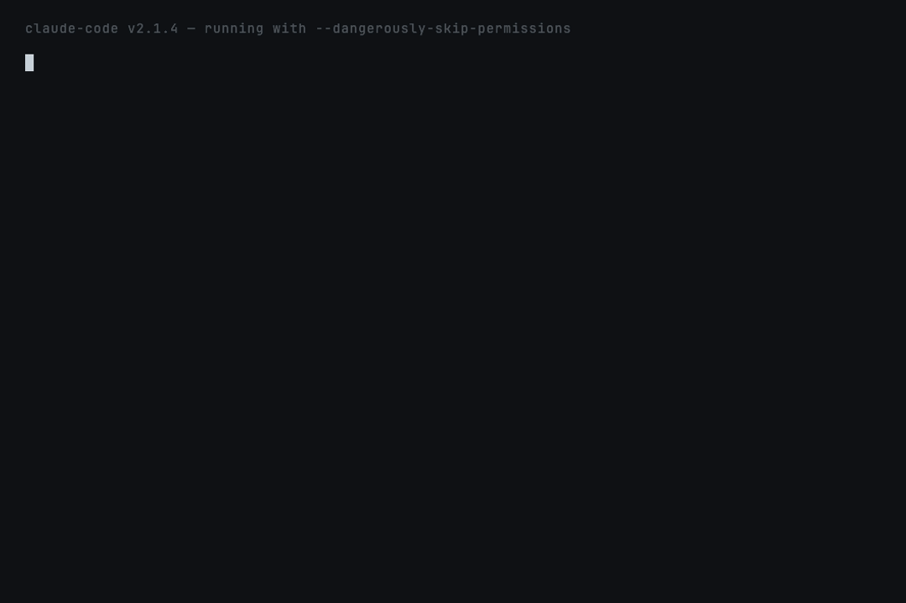

# `safe-shell` — refuse destructive Bash commands

**Fixes:** Documented YOLO-mode incidents per
[UpGuard's Claude Code cybersecurity analysis (Dec 2025)](https://www.upguard.com/blog/claude-code-cybersecurity-risks)
and the [ClaudeLog YOLO-mode reference](https://www.claudelog.com/configuration/yolo-mode/) —
home-directory deletions and `rm -rf /` from root when Claude Code ran
with `--dangerously-skip-permissions` and no supervision.



## What this prevents

> *"A Claude Code session running with `--dangerously-skip-permissions`
> issued `rm -rf ~/` while attempting to 'clean up the project
> directory.' The user lost their entire home folder."* — Dec 2025
> postmortem

Anthropic's own permission prompt is the safety net for destructive
commands. In YOLO mode that net is gone. `safe-shell` sits *below* the
permission layer and refuses a curated list of irreversible
operations *regardless* of permission mode.

## How it works

```
Claude → wants to run Bash(command)
        │
        ▼
   PreToolUse hook fires
        │
        ▼
Match command against block-list regex set
        │
   ┌────┴────┐
   │         │
   No match  Match
   │         │
   ▼         ▼
silent      Emit {"permissionDecision":"deny",
              "permissionDecisionReason": "<why>"}
            → Claude Code refuses + feeds reason back to Claude
```

## What's installed

| Path | What |
|---|---|
| `skills/safe-shell/SKILL.md` | Auto-invocation description + rule-set explainer |
| `skills/safe-shell/hooks/guard.sh` | PreToolUse hook (bash + python) |
| `hooks/hooks.json` | Registers the hook scoped to `Bash` tool |

## The block-list

| Category | Examples |
|---|---|
| Filesystem wipes | `rm -rf /`, `rm -rf ~/`, `rm -rf $HOME`, `rm --no-preserve-root` |
| Credential / git destruction | `rm -rf .git`, `rm -rf ~/.ssh`, `git reset --hard HEAD~3`, `git clean -fd`, `git branch -D` |
| Force-push | `git push --force`, `git push -f`, `--force-with-lease` |
| Disk-level | `mkfs`, `fdisk`, `parted`, `dd of=/dev/sd*` |
| Permission nukes | `chmod -R 777 /`, `chown -R … /` |
| Remote-code-exec | `curl … \| sh`, `wget … \| bash` |
| Fork bombs | `:(){ :\|:& };:` |
| Sudo + system dirs | `sudo rm -rf /usr`, `sudo rm -rf /etc` |

**Allowed** (intentionally — these are common project cleanup ops):
- `rm -rf node_modules`, `rm -rf ./dist`, `rm -rf .next`
- `git reset --hard HEAD` (not `HEAD~N`)
- `git clean -n` (dry-run only)

## Sample blocked output

When Claude tries to run `rm -rf ~/`, the PreToolUse hook emits:

```json
{
  "hookSpecificOutput": {
    "hookEventName": "PreToolUse",
    "permissionDecision": "deny",
    "permissionDecisionReason": "safe-shell (claude-papercuts) refused this command.\nCommand:  rm -rf ~/\nReason:   rm -rf against /, ~, or $HOME — irreversible filesystem wipe.\n\nIf this is intentional, run it yourself in your own shell. safe-shell will not unblock destructive operations even in --dangerously-skip-permissions mode."
  }
}
```

Claude Code shows the reason to the user and feeds it back to Claude as
an error. Claude can then re-plan (e.g. ask the user to run it
manually, or pick a less destructive approach).

## Trying it locally

```bash
claude --plugin-dir ~/claude-papercuts --permission-mode bypassPermissions
# Ask Claude to do something that would trigger a destructive command.
# The hook refuses regardless of permission mode.
```

## What survives what

| | Normal mode | `--dangerously-skip-permissions` |
|---|:---:|:---:|
| Anthropic's permission prompt | ✅ | ✗ |
| safe-shell block | ✅ | ✅ |

## What this skill does NOT do

- **Not a complete security layer.** It refuses the highest-hazard,
  most-irreversible commands. It does not stop crafted obfuscation
  (e.g. `r''m -rf /`, base64-encoded payloads, multi-step scripts).
  Treat it as a seatbelt, not a vault.
- **Does not log blocked attempts.** The block is visible to Claude
  via the hook reason; nothing is written to disk.
- **No override flag.** Even with `--dangerously-skip-permissions`, the
  block stands. Run intentional destructive ops in your own shell.

## Privacy

No network calls. The hook reads only the Bash command string passed
by Claude Code.

## Deprecation plan

If Anthropic ships a first-class destructive-command refusal layer
that survives `--dangerously-skip-permissions`, this skill becomes a
duplicate and gets deprecated in the next monthly release with the
date.
