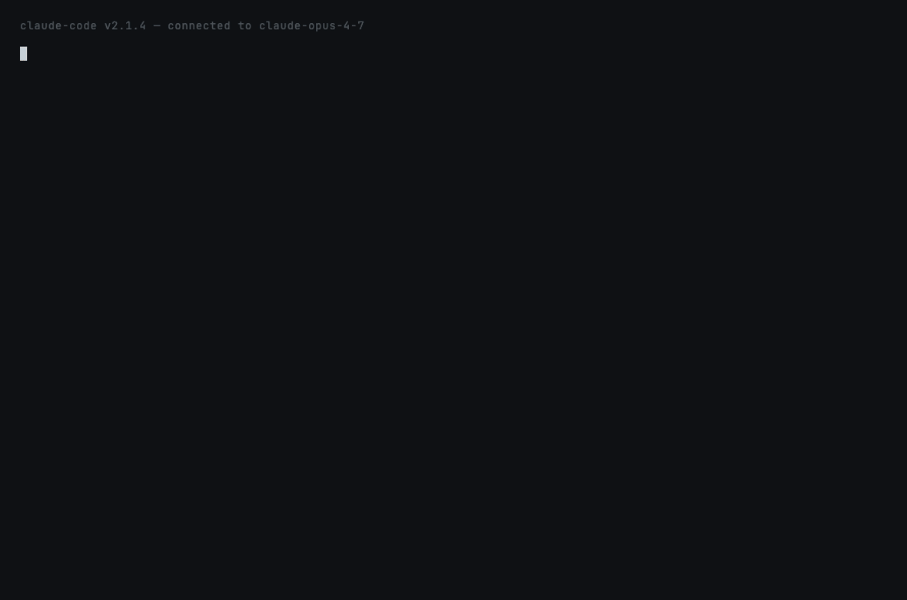

# `skill-doctor` — why isn't my skill auto-invoking?

**Fixes:** root cause of
[`anthropics/claude-code#30387`](https://github.com/anthropics/claude-code/issues/30387) —
custom skills not reliably auto-triggered because their descriptions
compete with Claude's training-time knowledge of built-in operations.



## What this prevents

> *"Skills for git/shell operations are ignored ~50% of the time.
> The model's training-time knowledge competes with and takes
> precedence over skill instructions."* — issue #30387

When a SKILL.md description says *"use for git operations"* or
*"reads files"*, Claude's training-time defaults for the built-in
`Bash` / `Read` tool win. The skill is never invoked. `skill-doctor`
lints SKILL.md files against the heuristics Anthropic's template
authors apply implicitly.

## How it works

```
User runs /claude-papercuts:skill-doctor
        │
        ▼
Run lint.py with the path or --all
        │
        ▼
Discover SKILL.md files:
  ~/.claude/skills/*/SKILL.md
  .claude/skills/*/SKILL.md
  ~/.claude/plugins/**/skills/*/SKILL.md
        │
        ▼
For each, parse frontmatter and check:
  ├─ name is kebab-case          (error if not)
  ├─ description 50–1024 chars   (error if not)
  ├─ has 'Use this when…' phrase (warn if missing)
  ├─ avoids training-overlap     (warn — 'edits files', 'runs shell')
  └─ avoids vague generic words  (info — 'helper', 'utility')
        │
        ▼
Render per-skill report + summary
```

## What's installed

| Path | What |
|---|---|
| `skills/skill-doctor/SKILL.md` | Auto-invocation description + invoke procedure |
| `skills/skill-doctor/lint.py` | Standalone Python — no deps, works on macOS / Linux / WSL |

## The checks

| Code | Severity | What it catches |
|---|---|---|
| `no-name` | error | Frontmatter missing `name:` |
| `bad-name` | error | Name not kebab-case lowercase |
| `no-description` | error | Frontmatter missing `description:` |
| `desc-too-short` / `desc-too-long` | error | Outside the 50–1024 char bound |
| `desc-thin` | warn | Under 80 chars — not enough context to route on |
| `no-trigger` | warn | Missing "Use this when …" / "Use for …" / "Invoke when …" |
| `training-overlap` | warn | "edits files", "git operations", "runs shell", etc. |
| `vague-helper` / `vague-utility` / ... | info | Generic words without specificity |

## Sample output

```text
skill-doctor — lint 1 SKILL.md file(s)
────────────────────────────────────────────────────────────

Bad_Name_2  /tmp/bad-skill.md
  ✗ ERROR bad-name        name 'Bad_Name_2' should be kebab-case ([a-z][a-z0-9-]+)
  ⚠ WARN  desc-thin       description is only 54 chars — add a trigger phrase
  ⚠ WARN  no-trigger      no 'Use this when …' phrase — model has nothing to route on
  ⚠ WARN  training-overlap vague 'git operations' — name the specific git workflow
  ⚠ WARN  training-overlap 'reading files' overlaps with the built-in Read tool
  · INFO  vague-helper    a 'helper' that doesn't say what it helps with
  · INFO  vague-utility   a generic 'utility' without a clear scope

────────────────────────────────────────────────────────────
1 skill(s) with errors  (4 warnings)
```

Exit code is `1` if any errors, `0` otherwise — wire into CI.

## Trying it locally

```bash
claude --plugin-dir ~/claude-papercuts
/claude-papercuts:skill-doctor
```

Or run the script directly:

```bash
~/claude-papercuts/skills/skill-doctor/lint.py path/to/SKILL.md
~/claude-papercuts/skills/skill-doctor/lint.py --all
~/claude-papercuts/skills/skill-doctor/lint.py --all --json
```

## Configuration

| Flag | What |
|---|---|
| `path` | Lint a single SKILL.md by path |
| `--all` | Scan every discoverable SKILL.md across user + project + plugins |
| `--json` | Machine-readable JSON (good for CI) |
| `--no-color` | Disable ANSI colors |
| `--cwd PATH` | Project dir for `--all` (default `$PWD`) |
| `--home PATH` | Home dir for `--all` (default `$HOME`) |

## What this skill does NOT do

- **Does not modify SKILL.md files.** Suggestions only.
- **Does not lint the body.** Only the frontmatter and description.
- **Does not validate `allowed-tools:` globs.** Claude Code's plugin
  loader does that.
- **Does not run skills to verify they trigger.** Trigger-fuzz mode
  is planned for a future release.

## Deprecation plan

If Anthropic ships a built-in SKILL.md linter (e.g. via
`claude plugin validate`), this skill becomes a duplicate and gets
deprecated in the next monthly release with the date.
