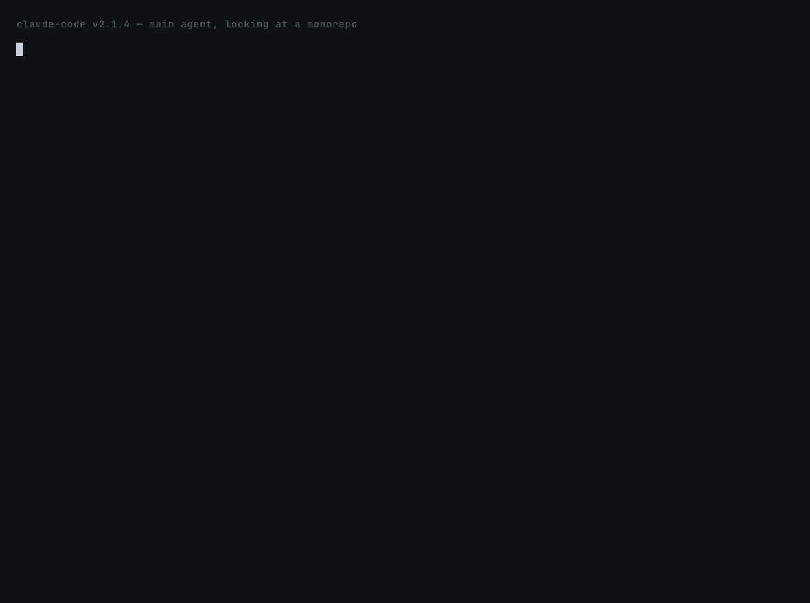

# `subagent-broker` — Task-tool delegation that survives the pitfalls

**Fixes:**
[`anthropics/claude-code#4182`](https://github.com/anthropics/claude-code/issues/4182),
[`anthropics/claude-code#5528`](https://github.com/anthropics/claude-code/issues/5528),
[`anthropics/claude-code#19077`](https://github.com/anthropics/claude-code/issues/19077)



## What this prevents

> *"Sub-agents claim no Task tool access despite configuration stating
> tools: Read, Write, Edit, Task. CRITICAL rules are completely
> disregarded. No actual delegation occurs."* — issue #5528

The Task tool is the official delegation mechanism, but it fails
silently when the delegation prompt isn't structured right:
open-ended prompts return shallow output, `CRITICAL` directives are
ignored, briefed-with-conclusion prompts produce sycophantic answers,
and people assume subagents share state when they don't.

`subagent-broker` ships the prompt skeletons that survive these
pitfalls — distilled from the issue threads themselves and our own
delegation experiments.

## How it works

```
User asks "how should I delegate this?"
        │
        ▼
Run templates.py — list 5 named patterns + use cases
        │
        ▼
Pick the matching one — print its body
        │
        ▼
Adapt placeholders to the user's task
        │
        ▼
Claude makes the Task call(s) — user reviews the prompt first
```

## What's installed

| Path | What |
|---|---|
| `skills/subagent-broker/SKILL.md` | Auto-invocation + the non-obvious rules from the issues |
| `skills/subagent-broker/templates.py` | Standalone Python — no deps, prints the named templates |

## The 5 templates

| Template | When to use |
|---|---|
| `parallel-search` | N independent searches at once. Call all Task tools in one message — sequential calls run sequentially. |
| `single-research` | One deep research question that's noisy in the main context. Cap the response length explicitly. |
| `cross-file-audit` | Consistency review across files. Front-load the single most-important rule and re-assert it in the response-format section. |
| `known-target` | **Don't delegate.** Use Read/Grep directly. Subagents have 5–10× the overhead of a direct call. |
| `independent-verification` | Second opinion. Withhold your conclusion — subagents anchor on your framing. |

## Sample output

```text
$ templates.py parallel-search

# parallel-search
# Use case: Spawning N independent searches at once (e.g. find all callers across a monorepo)
# Pitfall:  Sequential bash greps are slow; serial agents inflate cost. Parallel delegation only works if each subagent's prompt is self-contained — they cannot see each other's results.
# ──────────────────────────────────────────────────────────

Use the Task tool to spawn N subagents in PARALLEL. Each should be given a
SELF-CONTAINED prompt — they cannot share state. Each subagent gets:
  - subagent_type: 'general-purpose' (or 'Explore' for read-only searches)
  - description: 3-5 word task summary
  - prompt: a complete brief stating:
      * what to find (be specific: regex, file glob)
      * where to look (paths, exclusions)
      * what to report back (format, max length)
      * how to handle 'not found' (return empty list, not error)
...
```

## Trying it locally

```bash
claude --plugin-dir ~/claude-papercuts
/claude-papercuts:subagent-broker
```

Or run the script directly:

```bash
~/claude-papercuts/skills/subagent-broker/templates.py
~/claude-papercuts/skills/subagent-broker/templates.py parallel-search
~/claude-papercuts/skills/subagent-broker/templates.py --search research
~/claude-papercuts/skills/subagent-broker/templates.py --json
```

## The non-obvious rules (from the issues)

These are the rules the issue threads complain about the most:

1. **State the most-important constraint twice.** Once near the top
   of the prompt, once in the response-format section. `CRITICAL` /
   `ALWAYS` keywords don't help; placement does. (issue #5528)
2. **Cap the response length explicitly.** Subagents will read every
   file they find if you don't tell them not to.
3. **Parallelize in a single message.** Two `Task` calls in two
   consecutive messages run sequentially. Same message → parallel.
4. **Don't tell the subagent your conclusion.** They'll anchor on it.
   For verification, withhold your analysis.
5. **Subagents are 5-10× more expensive than a direct tool call.**
   Delegate only when the subagent will make 3+ tool calls.

## What this skill does NOT do

- **Does not fire Task for you.** Claude calls Task with the adapted
  template; the user reviews first.
- **Does not validate the subagent's output.** The subagent's report
  is the verdict.
- **Not a queue / dispatcher.** Earlier drafts shipped a queue + spawn
  system; we cut it because it duplicates Task's behavior.

## Deprecation plan

If Anthropic ships first-class delegation reliability (per issues
#4182, #5528, #19077), the templates become less load-bearing and
this skill can simplify or deprecate.
