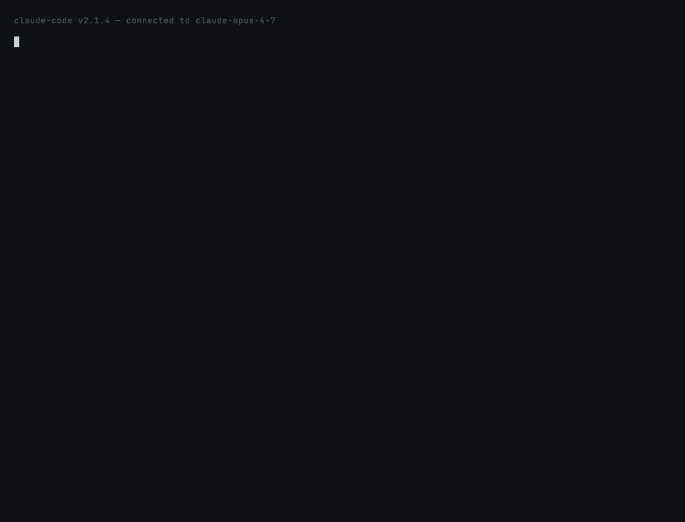

# `token-x-ray` — see where your context tokens went

**Fixes:**
[`anthropics/claude-code#39686`](https://github.com/anthropics/claude-code/issues/39686)



## What this prevents

> *"43 claude.ai Skills (~3,950 tokens) and 26 Cowork plugins (~2,020
> tokens) silently injected into Claude Code context — no opt-out, ~6k
> tokens wasted per session."* — issue #39686

`/context` shows category totals — *"Skills: 4,200 tokens"* — but no
per-item breakdown. You don't know which forty-of-your-skills is doing
the damage. `token-x-ray` itemizes every auto-injected source so you
can decide what to cut.

## How it works

```
User runs /claude-papercuts:token-x-ray
        │
        ▼
Run audit.py with whatever flags the user passed
        │
        ▼
Discover sources across the standard locations:
  • MCP servers    (~/.claude.json, .claude/settings*.json)
  • CLAUDE.md      (~/.claude/CLAUDE.md, <cwd>/CLAUDE.md)
  • Skills         (~/.claude/skills, .claude/skills, plugins/*)
  • Subagents      (~/.claude/agents, .claude/agents)
  • Commands       (~/.claude/commands, .claude/commands)
        │
        ▼
Estimate tokens (4 chars/token heuristic, MCP gets a per-server estimate)
        │
        ▼
Render: category roll-up + top 15 sources + "top cuts" recommendation
```

## What's installed

| Path | What |
|---|---|
| `skills/token-x-ray/SKILL.md` | Auto-invocation description + invoke procedure |
| `skills/token-x-ray/audit.py` | Standalone Python script — no deps, works on macOS / Linux / WSL |

## Sample output

```text
token-x-ray — auto-injected context audit
────────────────────────────────────────────────────────────
Project: /Users/you/code/my-app
Home:    /Users/you

Total estimated: 18,420 tokens  (@ 4 chars/token)

By category:
  MCP servers       ████████████████████████  12,000 tok  (8 items)
  CLAUDE.md         █████████░░░░░░░░░░░░░░░   4,210 tok  (2 items)
  Skills            ███░░░░░░░░░░░░░░░░░░░░░   1,580 tok  (22 items)
  Subagents         █░░░░░░░░░░░░░░░░░░░░░░░     430 tok  (4 items)
  Slash commands    ░░░░░░░░░░░░░░░░░░░░░░░░     200 tok  (3 items)

Top sources (by tokens):
  github            MCP servers   user      ██████████████████  1,500 tok  ~1500 tok (schema not measured)
  filesystem        MCP servers   user      ██████████████████  1,500 tok  ~1500 tok (schema not measured)
  project/CLAUDE.md CLAUDE.md     project   ██████████░░░░░░░░    830 tok
  ...

Top cuts (potential savings: ~4,500 tokens):
  → github       (1,500 tok, mcp)
      remove 'github' from .claude.json
  → filesystem   (1,500 tok, mcp)
      remove 'filesystem' from .claude.json
  → researcher   (1,500 tok, mcp)
      remove 'researcher' from .claude.json

⚠ 8 MCP server(s) declared. Token cost is a heuristic (1500 tok each).
  Run /context inside Claude Code for the authoritative number.
```

## Trying it locally

```bash
claude --plugin-dir ~/claude-papercuts
/claude-papercuts:token-x-ray
```

Or run the script directly:

```bash
~/claude-papercuts/skills/token-x-ray/audit.py
~/claude-papercuts/skills/token-x-ray/audit.py --json
~/claude-papercuts/skills/token-x-ray/audit.py --cwd /path/to/project
```

## Configuration

| Flag | Default | What |
|---|---|---|
| `--json` | off | Emit machine-readable JSON (per-source list + grouped totals) |
| `--no-color` | off | Disable ANSI colors (auto-disabled when stdout is not a tty) |
| `--cwd PATH` | `$PWD` | Project directory to audit (useful for scripting) |
| `--home PATH` | `$HOME` | Home directory to audit (useful for tests) |

## What about MCP tool schemas?

Real MCP tool schemas are only knowable by invoking the server, which
is slow and can fail. `token-x-ray` uses a per-server heuristic of
**~1,500 tokens** based on field reports for typical MCP servers and
flags it explicitly in the output. For the authoritative number, run
`/context` inside Claude Code — it's measured server-side.

The audit still shows the heuristic because most users want a "rough
shape of where my tokens are going" answer; the per-server estimate
is good enough to triage and tells you whether MCP is the elephant in
the room (it usually is).

## What this skill does NOT do

- **It does not actually invoke MCP servers.** See above — by design,
  for speed and reliability.
- **It does not modify any files or settings.** Suggested cuts are
  copy-paste commands, not auto-apply.
- **It does not count the conversation/transcript itself.** That's
  visible in `/context` directly and changes every turn.
- **It does not count fixed prompt overhead.** Anthropic's base system
  prompt + tool catalog aren't user-controllable, so we leave them out.

## Privacy

No network calls. Reads only the standard config locations listed
above and writes nothing.

## Deprecation plan

If Anthropic ships a per-item breakdown in `/context` (e.g. expandable
category rows showing each contributing skill / MCP / CLAUDE.md), this
skill becomes a UI duplicate and gets deprecated with the date.
